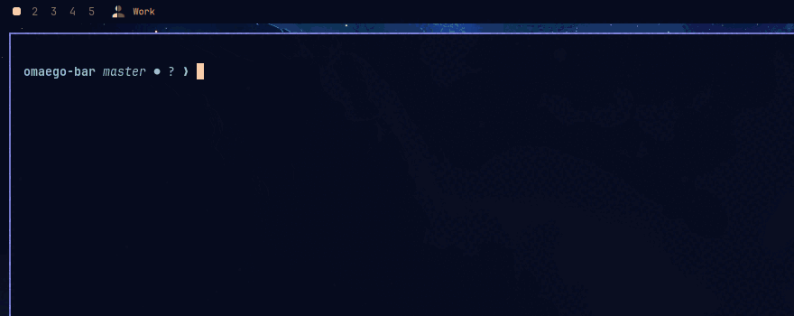

# omaego bar widget

> Powered by the [omaego](https://github.com/lcorneliussen/omaego) CLI.

Shows which **ego** — which browser identity — owns the workspace you are on,
and opens a panel to act on all of them.



The label names the egos with a browser window on the current workspace, in the
order their tiles appear. Clicking opens the panel: one **ego card** per ego,
faded when that ego has nothing here, each carrying its colour, its web apps,
and the actions that apply to it on this workspace. While the panel is open,
every ego's windows are outlined in that ego's colour, so the mapping between a
name and the tiles on screen is readable at a glance.

From a card you can launch the ego or one of its web apps here, add a web app
(`+app`), or close everything that ego has open on this workspace (`✕`). Below
the cards are the routing rules, with add and delete.

## Requires

This widget is a front end for the **omaego** CLI, which does the actual
routing. Install it first:

```bash
# Arch / Omarchy — pinned to a released tarball
git clone https://github.com/lcorneliussen/omaego
cd omaego/packaging && makepkg -si
omaego setup
```

Without it the widget loads and shows nothing, since it has no egos to report.

## Install

```bash
omarchy plugin add https://github.com/lcorneliussen/omaego-bar.git --enable
omarchy restart shell
```

The restart matters: a hot reload will not instantiate the widget in a new bar
section, and it simply will not appear, with nothing in the logs to say so.

Place it where you like with `omarchy bar move io.github.lcorneliussen.omaego
--section left`; it is designed to sit just after the workspaces.

## Remove

```bash
omarchy plugin remove io.github.lcorneliussen.omaego
omarchy restart shell
```

## Settings

| key | default | meaning |
|---|---|---|
| `command` | `omaego` | path to the CLI |
| `pollSeconds` | `3` | refresh interval; workspace changes refresh instantly |
| `hideWhenEmpty` | `false` | hide the widget on workspaces with no ego |
| `iconFont` | `JetBrainsMono Nerd Font` | font the split-person mark is drawn from |

## External dependencies

`omaego` (this widget shells out to it), and through it `python`, `hyprctl`,
and optionally `walker` for the pickers. The widget itself runs no network code
and reads no files directly; everything comes from `omaego panel --json`.

MIT licensed.

## Regenerating the screenshots

`scripts/demo.sh` rebuilds `preview.png` and `demo.gif` by driving a contained
Omarchy desktop ([omabox](https://github.com/omacom-io/omabox)) seeded with
invented egos, so a published asset can never contain a real identity, customer
or account. Rerun it after a UI change:

```bash
OMAEGO_SRC=~/Work/omaego scripts/demo.sh
```
